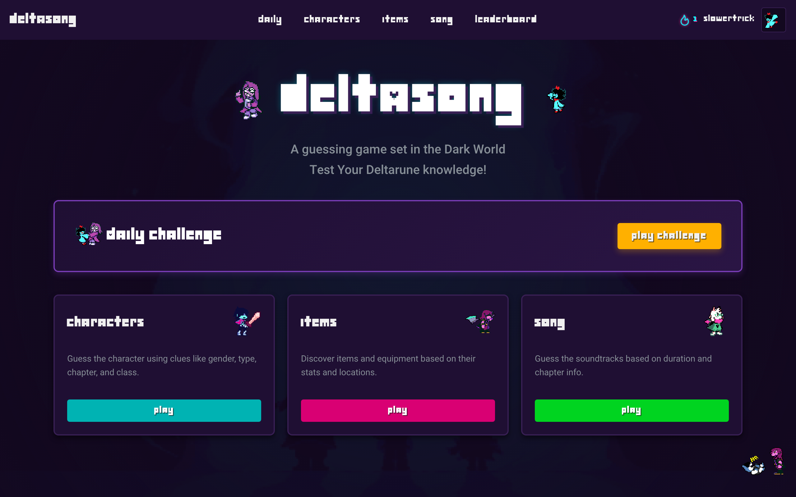
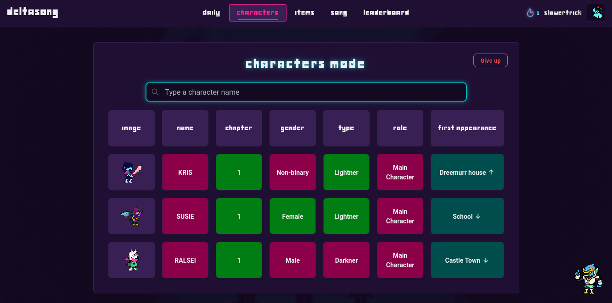
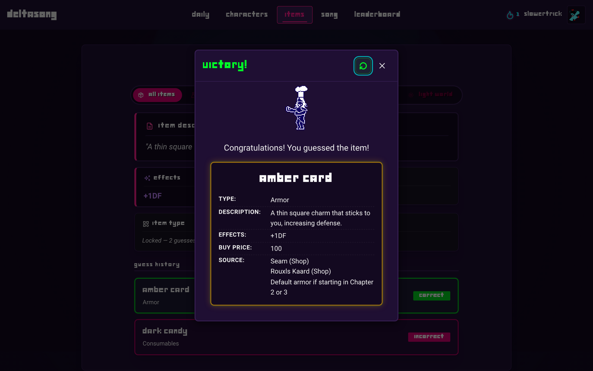
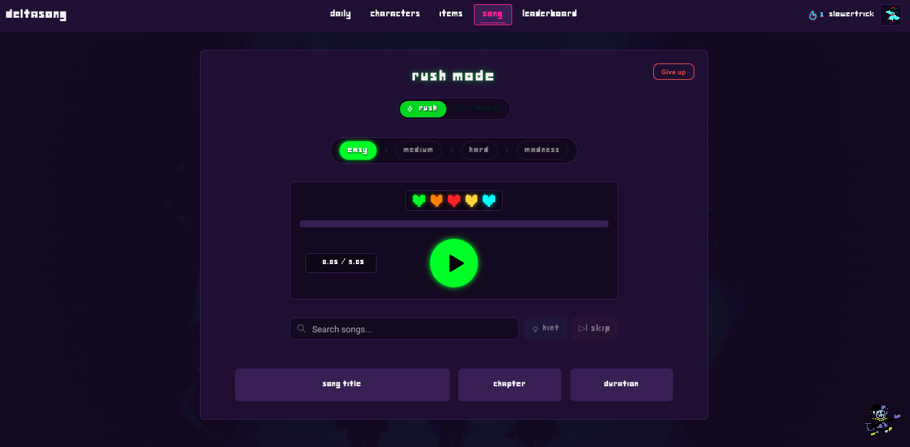
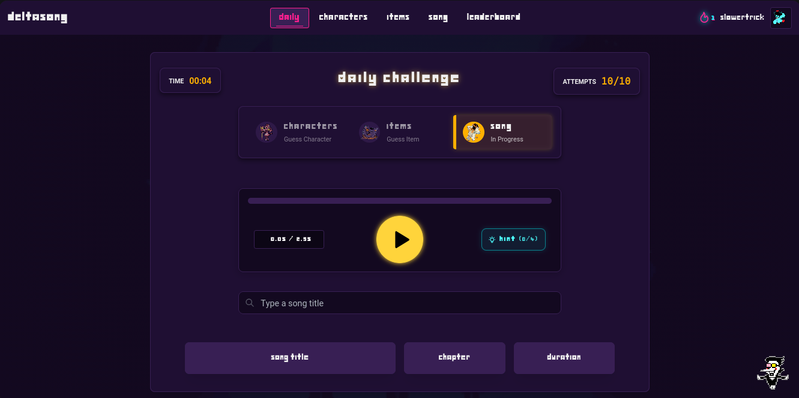
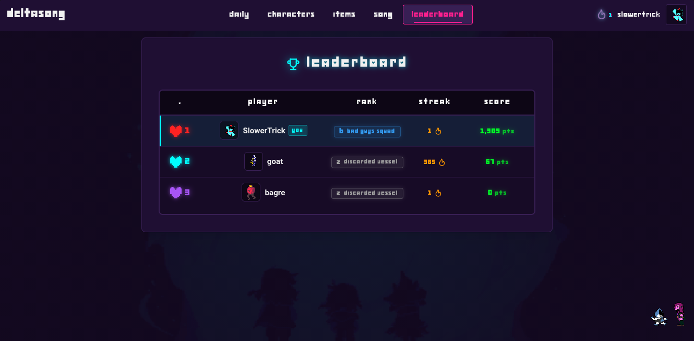
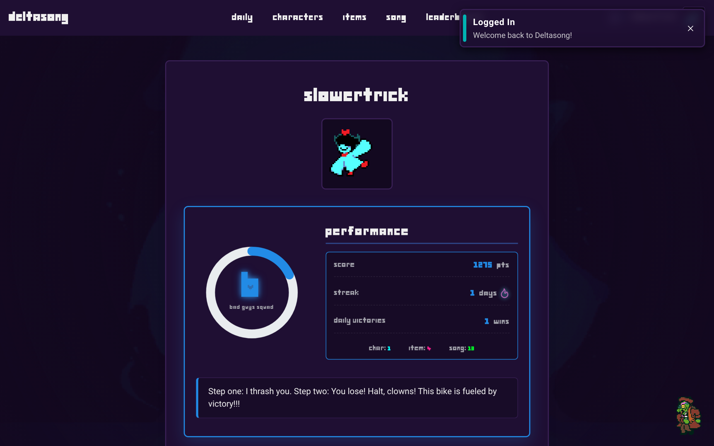

# Deltasong

Step into the Dark World. Deltasong is a fast-paced audio recognition, trivia, and deduction game built for DELTARUNE enthusiasts who know every note of Toby Fox's soundtrack, every inhabitant of Hometown, and every secret tucked away in the shadows.

Whether you are identifying a track from a razor-thin audio slice, methodically deducing mystery characters through strategic attribute clues, or clearing daily marathons, Deltasong turns your knowledge of the game into an addictive ritual.

---

## Gallery

See Deltasong in action across its deduction modes, audio challenges, and community rankings.

| | | |
| :---: | :---: | :---: |
| <br>**Dark World Hub** | <br>**Character Deduction** | <br>**Item Discovery** |
| <br>**Soundtrack Mode** | <br>**Daily Challenge** | <br>**Global Leaderboard** |
| <br>**Profile Dashboard** | | |

---

## What It Includes

- **Soundtrack Mode:**
  - **Classic:** Test your ear across customizable snippet windows from Easy (5.0s) to Madness (0.5s). Expand duration or reveal masked letter clues as needed.
  - **Rush:** A four-tier survival run spanning Easy through Madness. Manage five Soul lives, risk life-consuming skips, and capitalize on speed bonuses.
- **Characters Mode:** Deduce mystery figures across seven comparison vectors (gender, species/type, chapter, battle role, and appearance chronology).
- **Items Mode:** Decipher weapons, armor, consumables, and key items through five unlockable clue stages tied to incorrect guess thresholds.
- **Daily Challenge:** A synchronized 24-hour gauntlet generated deterministically by date. Three stages, ten guesses per stage, zero second chances.
- **Rankings and Progression:** Earn your standing through six distinct grades: Rank Z (*Discarded Vessel*), Rank C (*Big Shot*), Rank B (*Bad Guys Squad*), Rank A (*True Genius*), Rank S (*Prophecy Buster*), and Rank T (*TV Star*).
- **Instant Play & Cloud Sync:** Jump straight in as a guest with instant local storage, or sign in to permanently record your stats and claim your spot on the world stage.

---

## Getting Started

### Prerequisites

- Node.js (v18.0.0 or higher)
- Package manager: npm, pnpm, or yarn

### Installation

1. Clone the repository:
   ```bash
   git clone https://github.com/Artur-SLO/Deltasong.git
   cd Deltasong/frontend
   ```

2. Install dependencies:
   ```bash
   npm install
   ```

3. Configure environment variables (optional for local guest play):
   ```bash
   cp .env.example .env
   ```
   Add your Firebase credentials to enable cloud accounts and global leaderboards. If omitted, the game runs out-of-the-box in local Guest Mode.

4. Launch the application:
   ```bash
   npm run dev
   ```
   Open `http://localhost:5173` (or the port indicated in your console) to start playing.

---

## Tech Stack

- **Client:** React 19, Vite 8, React Router 8
- **Interface:** Mantine UI v9, Tabler Icons, CSS Modules
- **Services:** Firebase Authentication, Cloud Firestore with database-level security validation
- **Media:** HTML5 Audio, YouTube embedded stream integration, animated pixel art sprites

---

## Contributing

Contributions, bug reports, and track suggestions are always welcome.

1. Fork the repository.
2. Create a feature branch (`git checkout -b feature/new-mode`).
3. Commit your changes (`git commit -m 'feat: introduce new mode'`).
4. Push to the branch (`git push origin feature/new-mode`).
5. Open a Pull Request.

---

## Credits and Disclaimer

- **DELTARUNE & UNDERTALE:** All characters, lore, art assets, and music are intellectual property of Toby Fox and Royal Sciences LLC.
- **Fair Use Notice:** Deltasong is an open-source, non-commercial fan creation developed purely for entertainment and educational purposes under fair use.
- **Author:** Developed by [Artur Vítor (Artur-SLO)](https://github.com/Artur-SLO).

---

## License

Distributed under the MIT License. See [LICENSE](./LICENSE) for details.
